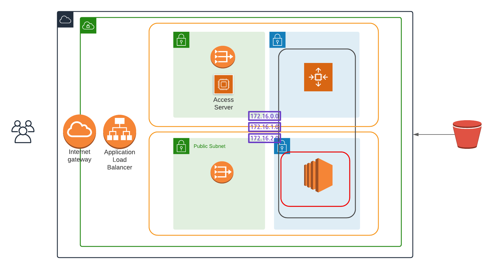

# LAB02 - Deploy High-availability web app using CloudFormation

## Introduction

Design and deploy an scalable, highly available infrastructure to host the Udagram application on the AWS cloud.

## Infrastructure Diagram

Main point of access to the application is a load balancer that points to an auto-scaling group where the application will be hosted. The auto-scaling group will start 2 instances minimum and a maximum of 4. The instances will be started on 2 private sub-nets, without direct access from the internet.



## How to execute

To deploy the infrastructure execute the following command from the linux shell prompt

```
./deploy.sh
```
